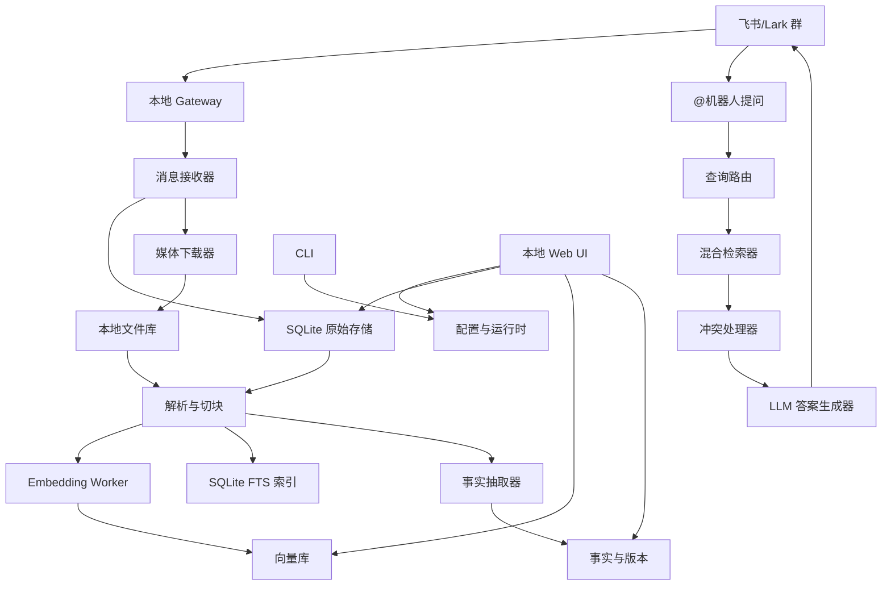

# 技术架构

## 总体架构



## 运行时

- Node.js 20+。
- TypeScript。
- npm 全局包。
- 本地优先运行。

## 推荐技术栈

### CLI

- `commander`：命令结构。
- `@inquirer/prompts`：交互式 setup/settings。
- `pino`：日志。

### Gateway 和 API

- `fastify`：本地 HTTP API 和 Web UI 后端。
- `@larksuiteoapi/node-sdk`：飞书/Lark API 和长连接能力。

### Web UI

- React。
- Vite。
- TanStack Query。
- TanStack Router。
- Tailwind CSS。
- Radix UI 或 shadcn/ui。

### 存储

- SQLite：元数据、原始消息、任务、配置、事实、embedding 向量。
- Drizzle ORM：schema 和 migration。
- SQLite FTS5：关键词检索。
- SQLite embedding 向量索引：语义检索，向量存入 `message_chunk_embeddings`，运行时在 Node.js 侧计算余弦相似度。

SQLite 同时负责结构化元数据、关键词召回和本地 embedding 向量存储。MVP 不引入需要平台 native optional dependency 的外部向量库，以保证 npm 全局安装后可直接运行。

### LLM 和 Embedding

- OpenAI-compatible chat completions API。
- OpenAI-compatible embeddings API。
- 可配置 base URL、API key、模型名和向量维度。
- `doctor` 必须验证 provider 兼容性。

### 解析器

- PDF：`pdf-parse` 或 `unpdf`。
- DOCX：`mammoth`。
- XLSX：`xlsx`。
- PPTX：先解压 XML 提取，之后再接专用 parser。
- HTML/链接：`cheerio` 加 readability。
- OCR：可配置路径，使用 Tesseract.js 或基于视觉模型的 OCR。
- 音频：先支持可配置的 OpenAI-compatible transcription，之后支持本地 Whisper。

## 本地数据布局

默认：

```text
~/.chattercatcher/
  config.json
  secrets.json
  data/
    chattercatcher.db
    exports/
    files/
    thumbnails/
    transcripts/
    vector/
  logs/
  cache/
```

`config.json` 存普通配置。

`secrets.json` 存敏感值：

- 飞书 App Secret。
- LLM API Key。
- embedding API Key，若和 LLM 分开。

## 核心数据模型

### chats

```text
id
platform
platform_chat_id
name
created_at
updated_at
```

### messages

```text
id
platform
platform_message_id
chat_id
sender_id
sender_name
message_type
text
raw_payload_json
sent_at
received_at
created_at
```

### files

```text
id
message_id
platform_file_key
file_name
mime_type
local_path
sha256
size_bytes
parse_status
created_at
updated_at
```

### chunks

```text
id
source_type
source_id
chunk_index
text
metadata_json
created_at
```

### embeddings

```text
id
chunk_id
provider
model
dimension
embedding_json
updated_at
```

### facts

```text
id
subject
predicate
value
confidence
status
source_chunk_id
supersedes_fact_id
valid_from
created_at
```

### qa_logs

```text
id
chat_id
question_message_id
question
answer
citations_json
retrieval_debug_json
created_at
```


### person_profiles

```text
id
primary_name
notes
created_at
updated_at
```

### person_identities

```text
person_id
platform
platform_chat_id
external_user_id
display_name
alias
source
first_seen_at
last_seen_at
```

### profile_entries

```text
id
person_id
category
content
entry_type
confidence
status
source
created_at
updated_at
last_observed_at
```

### profile_evidence

```text
entry_id
message_id
quote
reason
```

### dream_state

```text
platform
platform_chat_id
last_message_id
last_message_sent_at
updated_at
```

### dream_runs

```text
id
platform
platform_chat_id
status
processed_message_count
generated_entry_count
error
started_at
finished_at
```

### jobs

```text
id
type
status
payload_json
attempts
last_error
created_at
updated_at
```

## RAG 设计

RAG 是强制架构路径，不能被 prompt 堆叠替代。

检索流程：

1. 问题改写和意图识别。
2. 对 chunk 做 SQLite embedding 向量检索。
3. 通过 SQLite FTS5 做关键词检索。
4. 按群、时间、发送人、来源类型做元数据过滤。
5. 引入时间权重和来源权重重排。
6. 进入事实级冲突处理。
7. LLM 只基于最终证据块生成答案和引用。

答案生成器只能接收压缩后的证据块，不能接收无限制原始聊天历史。


## 人物档案（Personal Profiles）

人物档案是以人物为中心的知识组织方式。每个群成员在 ChatterCatcher 中拥有独立的档案，包含从聊天消息中提取的事实和推断。

### 档案数据流

```text
消息入库 -> 人物身份解析 -> PersonIdentity 注册
  -> Dream Processor（周期性批量分析）
  -> LLM 提取档案更新
  -> ProfileRepository upsert entries
  -> RAG 检索时作为证据源
```

### 档案条目类型

- **fact**：从聊天中明确提取的事实，如"豆豆的编程课是每周六下午 2 点"，置信度高。
- **inferred**：从聊天模式推断的信息，如"豆豆喜欢编程"，置信度相对较低。

### Dream 处理器

Dream 是对人物档案的自动更新机制：

1. 读取群的 dream_state，获取上次处理位置。
2. 从 message 表批量拉取新消息（默认每批 100 条）。
3. 收集本批消息涉及的所有 personId，加载现有档案。
4. 将消息和现有档案通过 LLM 分析，输出档案更新列表。
5. 验证每个更新：personId 存在、证据消息在本批次内、置信度在 0-1 范围。
6. Upsert 档案条目，更新 dream_state 光标。
7. 记录 dream_run（成功/失败/跳过）。

Dream 只基于当前批次消息输出更新，不回看全部历史，保证增量处理效率。

### RAG 集成

档案检索工具集成在 Agent 工具循环中：

- `get_person_profile`：根据人名或 personId 检索特定人物的档案。
- `list_person_profiles`：列出当前群的所有人物档案概要。

检索到的档案条目作为 RAG 证据源，和消息、文件、episode summary 一起参与重排和答案生成。

## 冲突处理

冲突处理不能简单“最新消息赢”。

必须检查：

- 主体相同或高度相似。
- 谓词相同。
- 新来源时间更晚。
- 存在更新语义，例如：
  - 改到。
  - 更新为。
  - 最终定。
  - 以这个为准。
  - 不是之前那个。
- 有足够置信度认为消息陈述的是事实，而不是建议。

状态：

- `active`：当前最可信事实。
- `superseded`：被较新确认事实取代的旧事实。
- `ambiguous`：相关证据，但不覆盖 active 事实。

## 飞书/Lark Gateway

MVP 采用本地 Gateway 模式：

- 用户创建飞书/Lark 自建应用。
- 用户启用机器人能力。
- 用户配置 App ID 和 App Secret。
- 用户启用长连接事件订阅。
- ChatterCatcher 从本机打开长连接。
- 传入消息事件被归一化为内部 message。
- 回复通过飞书/Lark Bot API 发送。

实现上使用 `@larksuiteoapi/node-sdk` 的 `WSClient` 和 `EventDispatcher`：

```text
WSClient 长连接 -> EventDispatcher im.message.receive_v1 -> GatewayIngestor -> SQLite RAG
```

Gateway 层只负责接收和归一化事件，不直接参与 RAG 答案生成，避免平台细节污染知识库和检索层。

当消息命中 `@ChatterCatcher` 时，Gateway 会在入库后触发问答流程，但检索时必须排除本次提问消息，避免把问题本身当作证据。回复链路为：

```text
@消息 -> 入库 -> 排除当前消息 -> 混合检索 -> askWithRag -> 飞书 message.create 回复群聊
```

必需事件：

```text
im.message.receive_v1
```

必需行为：

- 群聊默认需要 `@机器人` 才回答。
- 除非配置禁用，否则所有消息仍会被捕获。
- 私聊可以后续支持。

## 配置

配置必须能从这些入口编辑：

- `chattercatcher setup`
- `chattercatcher settings`
- 本地 Web UI

关键字段：

```json
{
  "feishu": {
    "domain": "feishu",
    "appId": "",
    "groupPolicy": "open",
    "requireMention": true
  },
  "llm": {
    "baseUrl": "",
    "model": ""
  },
  "embedding": {
    "baseUrl": "",
    "model": "",
    "dimension": null
  },
  "storage": {
    "dataDir": "~/.chattercatcher/data"
  },
  "web": {
    "host": "127.0.0.1",
    "port": 3878
  }
}
```

secrets 不得存入该文件。

## 运维命令

```bash
chattercatcher setup
chattercatcher settings
chattercatcher doctor
chattercatcher gateway start
chattercatcher gateway status
chattercatcher gateway stop
chattercatcher gateway restart
chattercatcher logs --follow
chattercatcher logs --lines 200 --file gateway.log
chattercatcher index rebuild
chattercatcher process messages
chattercatcher export --out ./backup.json
chattercatcher restore ./backup.json --replace
chattercatcher data delete message <messageId> --yes
chattercatcher data delete file <messageId> --yes
chattercatcher data delete chat <chatId> --yes
chattercatcher web start
```

`gateway start` 以前台进程运行，并在 `~/.chattercatcher/gateway.pid` 写入运行记录。`gateway stop` 读取该 PID 文件发送停止信号；如果 PID 已过期，会清理陈旧记录。后台服务安装仍属于 M3 的 service 能力。

`restore` 默认合并导入导出文件中的 chats、messages、message_chunks、message_chunk_embeddings 和 file_jobs，并重建 SQLite FTS。只有显式传入 `--replace` 时才会先清空当前本地知识库；恢复后如果使用语义检索，可以运行 `index rebuild` 重新生成 SQLite embedding 向量。

`data delete` 删除 SQLite 知识库记录、关联 chunks、SQLite FTS 条目、SQLite embedding 向量和文件解析任务。删除文件知识源时，只会清理位于 `storage.dataDir` 内的本地保存文件，不会删除外部源文件。

`process messages` 立即运行消息索引处理。SQLite FTS 在消息入库时已经即时更新；该命令主要用于立刻把消息 chunks 写入 SQLite embedding 向量索引，等价于手动触发原本可由定时任务承担的处理动作。Web UI 首页的“立即处理”按钮调用同一条 API。

## 测试策略

分层测试：

- 纯逻辑单测：
  - 配置校验。
  - 消息归一化。
  - 切块。
  - 冲突处理。
  - 引用格式。
- 集成测试：
  - SQLite migration。
  - 向量库 adapter。
  - 索引任务。
  - mock 飞书事件。
  - mock OpenAI-compatible provider。
- UI 测试：
  - settings 页面。
  - history 页面。
  - 文件库。
  - 问答日志。

手工 smoke test：

- 全新 setup。
- Gateway start。
- 消息捕获。
- `@机器人` 触发回答。
- 重建索引。
- Web UI 检查。
